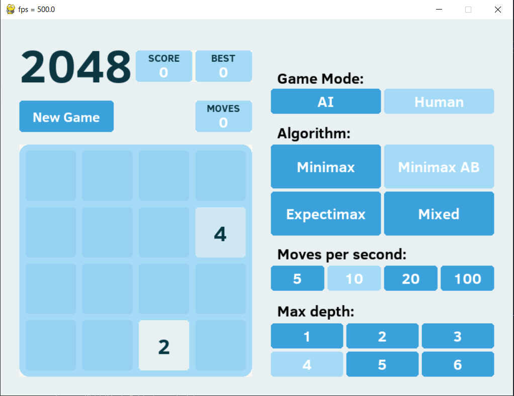

# 2048 AI

## Introduction
+ A capstone project for Introduction to Artificial Intelligence course.
+ This is a small application of `minimax` and `expectimax` algorithm

## Collaborators
We are K65 of major Data Science and Artificial Intelligence of Hanoi University of Science and Technology.
+ Hoàng Văn An
+ Nguyễn Ngọc Dũng
+ Nguyễn Huy Hải
+ Nguyễn Hải Long
+ Dương Vũ Tuấn Minh

## Requirement:
+ Check [Requirement](Requirement.md)
